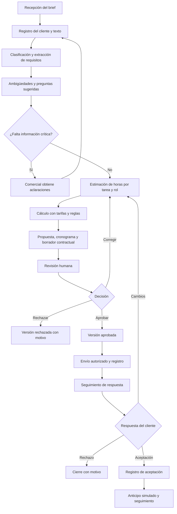

# CotizaIA

Proyecto universitario para la asignatura **Patrones de Software**.

CotizaIA es una plataforma propuesta para agencias pequeñas y freelancers. A partir de un brief desordenado, un agente procesará la solicitud por etapas, sin mantener una conversación: clasificará el proyecto, extraerá requisitos, señalará ambigüedades y sugerirá horas de trabajo. La aplicación calculará el precio mediante tarifas configuradas y preparará una propuesta, un cronograma y un borrador contractual. Una persona revisará y aprobará los resultados antes de enviarlos. La IA no decidirá el precio final ni firmará contratos.

Todo el sistema se desarrollará en **Java**, con **Spring Boot** para el backend y **PostgreSQL** como persistencia prevista.

## 1. Estado real del proyecto

**Revisión: 29 de septiembre de 2026.** El repositorio contiene un README inicial y metadatos de Git. No hay código fuente, dependencias, pruebas ni configuración de la aplicación. Este documento amplía la documentación inicial y define el alcance; todavía no existe una aplicación ejecutable.

| Estado | Significado | Situación actual |
| --- | --- | --- |
| Implementado | Existe código verificable que cubre la capacidad indicada. | Ninguna funcionalidad implementada en la carpeta revisada. |
| En desarrollo | Existe código parcial que aún no cumple sus criterios de aceptación. | No se encontró evidencia de implementación parcial. |
| Propuesto | Existe una definición pendiente de implementación. | Backend, seguridad, persistencia, IA, documentos, interfaz e integraciones. |

El equipo actualizará estos estados al incorporar código y verificar sus criterios de aceptación.

## 2. Planteamiento del problema y justificación

En una agencia pequeña, el propietario o comercial suele reunir información dispersa, interpretar necesidades, consultar al equipo, estimar horas y redactar documentos. Un brief puede mezclar funcionalidades, preferencias visuales, presupuesto y fechas sin distinguir prioridades. Los datos faltantes obligan a revisar supuestos; los cambios de alcance exigen ajustar precio y planificación.

CotizaIA busca apoyar estas tareas mediante un procedimiento repetible y revisable. El equipo conservará la responsabilidad sobre las tarifas, el alcance y las condiciones. El interés académico consiste en separar estas responsabilidades y aplicar patrones a problemas concretos de integración, cálculo y control de estados.

**Objetivo medible propuesto:** reducir al menos un 30 % la mediana del tiempo de preparación de una cotización revisada frente al procedimiento manual, usando diez briefs comparables. El equipo medirá desde el inicio del análisis hasta la aprobación interna, incluyendo correcciones y excluyendo la espera de respuestas del cliente. Alternará el orden de las modalidades y aplicará la misma lista de verificación de calidad. La línea base y los resultados están pendientes; la reducción no se ha demostrado.

## 3. Objetivos

### Objetivo general

Desarrollar en Java una plataforma que apoye la preparación de cotizaciones a partir de briefs, con cálculo trazable mediante tarifas configuradas y revisión humana obligatoria, aplicando patrones de software a su arquitectura.

### Objetivos específicos

- Registrar agencias, usuarios, clientes, servicios y tarifas.
- Transformar el texto del brief en requisitos, ambigüedades y estimaciones revisables.
- Calcular precios y cronogramas con datos y reglas explícitas.
- Preparar y editar propuestas y borradores contractuales con versiones identificables.
- Controlar revisión, aprobación, envío y seguimiento mediante transiciones válidas.
- Integrar IA mediante una interfaz Java sustituible y validar sus respuestas.
- Evaluar tiempo de preparación y calidad con casos de prueba documentados.

## 4. Actores del sistema

| Actor | Responsabilidad | Interacción prevista |
| --- | --- | --- |
| Propietario o comercial de agencia | Administrar datos comerciales y autorizar las condiciones y el envío. | Registra briefs, corrige resultados, aprueba versiones y registra seguimiento. |
| Colaborador revisor | Verificar requisitos, horas, supuestos y cronograma. | Consulta la cola de revisión, edita según sus permisos y devuelve observaciones o rechaza versiones. |
| Cliente | Proporcionar necesidades y aclaraciones; aceptar o rechazar propuestas. | Entrega el brief y recibe la propuesta aprobada. Inicialmente, el comercial registra sus respuestas; no se presupone un portal. |
| Agente de IA | Apoyar análisis y redacción mediante resultados estructurados. | Procesa etapas y entrega sugerencias; no puede aprobar, enviar, fijar condiciones finales ni firmar. |

## 5. Flujo de trabajo completo

Este flujo es **propuesto**. El comercial incorporará cada aclaración al brief como una nueva revisión; el agente no conversará con el cliente.



Ante un fallo de IA, el responsable podrá completar el análisis manualmente. Antes de incorporar integraciones de envío, el comercial enviará por su canal habitual y registrará el evento sobre una versión aprobada. Ese registro no acreditará una integración automática.

## 6. Alcance y límites

El alcance inicial comprende backend, ingreso de texto, datos comerciales, cálculo y revisión humana. La IA, los documentos y las integraciones se incorporarán en fases posteriores.

| Alcance propuesto | Límite |
| --- | --- |
| Sugerencias de clasificación, requisitos y horas. | El responsable verifica omisiones, supuestos y estimaciones. |
| Cálculo con tarifas, moneda y reglas registradas. | La IA no determina el precio final; los ajustes requieren registro y aprobación. |
| Documentos editables. | El contrato es un borrador sujeto a revisión; no incluye firma automática ni validez jurídica garantizada. |
| Aceptación y anticipo simulado. | No se procesa dinero real ni se comprueban transacciones bancarias. |
| Seguimiento de propuestas. | No comprende una plataforma completa de contabilidad, facturación o gestión de proyectos. |
| Integraciones posteriores. | Correo, WhatsApp, archivos, costos de servicios y despliegue requieren evaluación e implementación. |

La tecnología de la interfaz de usuario en Java está pendiente de selección.

## 7. Requisitos funcionales

**Prioridades:** alta = necesaria para el flujo principal; media = ampliación posterior. Los criterios describen pruebas futuras, no resultados obtenidos.

| ID | Requisito | Actor | Prioridad | Criterio de aceptación | Estado |
| --- | --- | --- | --- | --- | --- |
| RF-01 | Registrar agencias y usuarios e iniciar sesión. | Propietario y revisor | Alta | Crear agencia y usuario; aceptar credenciales válidas, rechazar inválidas y bloquear consultas a otra agencia. | Propuesto |
| RF-02 | Administrar servicios y tarifas por rol. | Propietario | Alta | Guardar servicio, rol, valor por hora y moneda; rechazar valores negativos y conservar la tarifa usada en cada cotización. | Propuesto |
| RF-03 | Registrar clientes. | Comercial | Alta | Crear y consultar un cliente asociado a una agencia; rechazar registros sin nombre y consultas desde otra agencia. | Propuesto |
| RF-04 | Ingresar briefs mediante texto pegado. | Comercial | Alta | Guardar texto no vacío con cliente, agencia y fecha; recuperar el contenido original sin alteraciones. | Propuesto |
| RF-05 | Clasificar proyectos y extraer requisitos. | Agente y revisor | Alta | Producir una categoría y requisitos identificables con referencia al texto o marca de supuesto para un brief de prueba. | Propuesto |
| RF-06 | Identificar ambigüedades y preguntas aclaratorias. | Agente y comercial | Alta | Ante un brief sin alcance de pagos, registrar la omisión y una pregunta; impedir aprobación si queda una ambigüedad crítica. | Propuesto |
| RF-07 | Estimar horas con desglose. | Agente y revisor | Alta | Mostrar tarea, rol, horas y supuestos por ítem; comprobar suma del total y rechazar horas negativas. | Propuesto |
| RF-08 | Calcular precio mediante tarifas y reglas. | Comercial | Alta | Con 10 horas a 50.000 COP y 4 a 60.000 COP, sin ajustes, obtener 740.000 COP; bloquear el cálculo si falta una tarifa. | Propuesto |
| RF-09 | Generar y editar propuestas. | Comercial y revisor | Alta | Crear versión con alcance, exclusiones, ítems, moneda y total; guardar una edición e invalidar la aprobación anterior. | Propuesto |
| RF-10 | Generar y editar cronogramas. | Comercial y revisor | Alta | Crear fases con horas, dependencias y capacidad declarada; recalcular la planificación al modificar horas. | Propuesto |
| RF-11 | Generar y editar borradores contractuales. | Comercial y revisor | Alta | Obtener un documento marcado como borrador, vinculado a la versión de propuesta y con campos pendientes identificados. | Propuesto |
| RF-12 | Gestionar cola de revisión, aprobación y rechazo. | Comercial y revisor | Alta | Listar pendientes; registrar usuario y fecha de decisión, exigir motivo al rechazar y bloquear acciones sin permiso. | Propuesto |
| RF-13 | Registrar envío y seguimiento. | Comercial | Alta | Rechazar envío de una versión no aprobada; registrar canal, fecha y versión al marcar envío y consultar historial. | Propuesto |
| RF-14 | Registrar aceptación o rechazo del cliente. | Cliente mediante comercial | Alta | Registrar respuesta, fecha y referencia de evidencia sobre una versión enviada; impedir aceptar un borrador. | Propuesto |
| RF-15 | Registrar anticipo simulado. | Comercial | Media | Asociar importe a una propuesta aceptada, marcarlo como simulación y rechazar importes negativos o superiores al total. | Propuesto |
| RF-16 | Consultar métricas. | Propietario | Media | Con datos conocidos, verificar cantidades por estado, tasa de aceptación y mediana del tiempo de preparación, indicando período y denominadores. | Propuesto |
| RF-17 | Integrar canales de entrada y envío. | Comercial | Media | Para cada canal incorporado, probar autorización, asociación al cliente, prevención de duplicados y registro de fallos; bloquear envíos sin aprobación. | Propuesto |

RF-17 contempla correo, WhatsApp y carga de archivos como integraciones posteriores. Ninguno existe todavía.

## 8. Requisitos no funcionales

Estos umbrales son **objetivos pendientes de implementación y medición**; no representan garantías actuales.

| ID | Categoría | Requisito medible | Forma de verificación | Estado |
| --- | --- | --- | --- | --- |
| RNF-01 | Seguridad | Proteger el 100 % de operaciones privadas con autenticación y autorización por agencia; almacenar contraseñas mediante hash adaptativo. | Probar accesos sin sesión, con rol insuficiente y entre agencias; inspeccionar almacenamiento. | Propuesto |
| RNF-02 | Privacidad | Excluir credenciales y datos de contacto innecesarios del 100 % de solicitudes al modelo y registros técnicos. | Capturar solicitudes y logs con datos ficticios; documentar retención antes de usar datos reales. | Propuesto |
| RNF-03 | Integridad de estados | Rechazar el 100 % de transiciones inválidas y ediciones concurrentes sobre versiones obsoletas. | Pruebas de matriz de estados, concurrencia y transacciones. | Propuesto |
| RNF-04 | Rendimiento | Alcanzar p95 menor o igual a 2 segundos en CRUD con 20 usuarios concurrentes durante 5 minutos, excluyendo IA y documentos. | Prueba de carga con equipo, volumen y configuración documentados. | Propuesto |
| RNF-05 | Disponibilidad ante errores de IA | Limitar cada intento a 30 segundos y permitir como máximo un reintento automático; conservar el brief y habilitar revisión manual. | Simular timeout, indisponibilidad y respuesta inválida; verificar datos y recuperación manual. | Propuesto |
| RNF-06 | Trazabilidad | Registrar actor, fecha, versión y motivo en el 100 % de aprobaciones, rechazos y cambios comerciales; identificar cada ejecución de IA. | Comparar eventos de prueba con historial, sin exponer secretos. | Propuesto |
| RNF-07 | Mantenibilidad | Probar cada regla de cálculo y transición; evitar dependencias del dominio hacia adaptadores de IA. | Ejecutar pruebas unitarias y revisar dependencias entre paquetes. | Propuesto |
| RNF-08 | Portabilidad entre proveedores | Sustituir Ollama por Groq mediante configuración y adaptador, sin modificar servicios de negocio. | Ejecutar las mismas pruebas de contrato con ambos adaptadores y respuestas controladas. | Propuesto |
| RNF-09 | Usabilidad | Lograr que al menos 4 de 5 participantes registren un brief y completen su revisión en menos de 10 minutos sin ayuda. | Prueba de tareas con datos ficticios cuando exista interfaz. | Propuesto |
| RNF-10 | Accesibilidad | Completar el flujo principal con teclado, foco visible, campos etiquetados y contraste de texto normal de al menos 4,5:1. | Medir contraste y probar teclado y lector de pantalla compatible con la interfaz Java elegida. | Propuesto |

## 9. Reglas de negocio

Estas reglas aún no cuentan con implementación.

1. Ninguna propuesta podrá enviarse ni registrarse como enviada sin aprobación humana de su versión vigente.
2. El precio se calculará con horas, tarifas y reglas registradas. Cada cotización conservará los valores utilizados y su moneda.
3. Cambiar horas obligará a recalcular precio y cronograma. Cambiar alcance, tarifas o condiciones invalidará la aprobación de la versión editada.
4. El responsable resolverá las ambigüedades críticas antes de aprobar; una pregunta de IA no equivale a una respuesta del cliente.
5. La IA no podrá aprobar, enviar, ejecutar pagos, firmar ni decidir el precio final.
6. Cada rechazo incluirá motivo; cada aprobación identificará usuario y versión.
7. La aceptación corresponderá a una versión enviada. Los cambios posteriores producirán una nueva versión sujeta a revisión.
8. No podrá emitirse contrato final antes de la aceptación y revisión humana de sus condiciones. La firma y formalización quedan fuera del alcance inicial.
9. Un pago simulado no acreditará cobro real y solo corresponderá a una propuesta aceptada.
10. Los usuarios accederán a datos de su agencia según sus permisos.
11. No se mezclarán monedas sin una regla explícita. Redondeo, impuestos y descuentos deberán definirse antes de implementar el cálculo.
12. El cronograma considerará capacidad y dependencias; las horas de esfuerzo no equivalen por sí solas a días calendario.

## 10. Arquitectura propuesta en Java

Spring Boot será el backend. **El repositorio todavía no usa PostgreSQL:** no contiene conexión, dependencias, migraciones ni tablas. Estos paquetes son previstos, no carpetas existentes.

| Capa | Responsabilidad prevista |
| --- | --- |
| `controller` | Recibir solicitudes HTTP, validar estructura y devolver respuestas y errores; delegar decisiones de negocio. |
| `service` | Coordinar casos de uso, transacciones, revisión humana y preparación de cotizaciones. |
| `domain` | Definir entidades, valores, cálculos y transiciones independientes del proveedor de IA. |
| `repository` | Definir y resolver acceso a datos; incorporar persistencia en PostgreSQL. |
| `agent` | Coordinar análisis, validar resultados y conectar proveedores mediante adaptadores. |
| `document` | Construir propuesta, cronograma y borrador contractual desde datos revisados y versionados. |
| `config` | Centralizar configuración de Spring, seguridad, persistencia y selección del proveedor. |

La dependencia principal será `controller → service → domain`. Los servicios usarán interfaces para persistencia, IA y documentos. El dominio no dependerá de formatos externos de modelos. El prototipo inicial podrá utilizar almacenamiento temporal sustituible, también pendiente de implementación, sin garantizar conservación entre reinicios.

## 11. Patrones de diseño

Son candidatos vinculados a necesidades concretas. El equipo implementará cada patrón cuando pueda justificarlo con código y casos de prueba.

| Patrón | Tipo | Aplicación concreta | Problema que resuelve | Estado real |
| --- | --- | --- | --- | --- |
| Facade | Estructural | Una operación de preparación coordina análisis, cálculo y documentos. | Evita que el controlador conozca todos los pasos. | Propuesto; sin código. |
| Adapter | Estructural | Traducir formatos de Ollama o Groq al contrato Java. | Aísla diferencias entre proveedores. | Propuesto; sin integración. |
| Strategy | Comportamiento | Encapsular reglas de cálculo cuando existan distintas modalidades comerciales. | Permite variar el cálculo sin acumular condiciones. | Propuesto; comenzar por horas. |
| State | Comportamiento | Representar comportamiento y transiciones de borrador, revisión, aprobado y enviado. | Impide operaciones incompatibles con el estado. | Propuesto; una enumeración sola no acreditará el patrón. |
| Builder | Creacional | Construir propuestas con alcance, ítems, condiciones y fases validadas. | Controla la construcción de un objeto compuesto. | Propuesto; sin clases. |
| Observer | Comportamiento | Notificar a auditoría y métricas tras confirmar una aprobación. | Desacopla efectos secundarios del caso de uso. | Propuesto; sin eventos. |
| Chain of Responsibility | Comportamiento | Encadenar validaciones de requisitos, tarifas, totales y aprobación. | Permite ordenar validaciones y detenerlas con un motivo de bloqueo. | Propuesto; sin cadena. |
| Factory Method | Creacional | Un creador de procesadores declara un método que sus variantes sobrescriben para construir el adaptador. | Separa construcción específica y flujo de procesamiento. | Propuesto, sujeto a necesidad; seleccionar un bean no basta para acreditarlo. |
| Template Method | Comportamiento | Definir validación, composición y renderizado con pasos especializados por documento. | Comparte un procedimiento estable con variaciones controladas. | Propuesto, sujeto a formatos elegidos. |

No se incluyen Singleton ni Decorator: todavía no existe una necesidad concreta que justifique añadirlos. La evaluación académica priorizará patrones demostrables.

## 12. Funcionamiento del agente de IA

**La IA aún no está integrada.** Ollama y Groq son opciones por evaluar; no hay proveedor, modelo ni configuración. Sus condiciones de uso y disponibilidad deberán verificarse durante la integración.

Etapas previstas:

1. Validar texto y preparar contexto mínimo, evitando datos personales innecesarios.
2. Clasificar y extraer requisitos vinculados al brief.
3. Identificar ambigüedades y preguntas para que el comercial consiga aclaraciones fuera del agente.
4. Sugerir tareas, roles y horas, distinguiendo datos explícitos de supuestos.
5. Validar estructura y reglas antes de incorporar resultados a una versión de trabajo.
6. Calcular precio con Java y tarifas registradas; planificar fases según capacidad y dependencias.
7. Preparar textos desde los datos validados y remitirlos a revisión humana.

Interfaz Java **ilustrativa, aún inexistente en el repositorio**:

```java
public interface ProveedorIA {
    ResultadoAnalisis analizar(SolicitudAnalisis solicitud)
            throws FalloProveedorIA;
}
```

Los tres tipos referenciados también son propuestos. Los futuros `OllamaAdapter` y `GroqAdapter` traducirán formatos externos a este contrato. El resultado contendrá categoría, requisitos, ambigüedades, tareas, horas sugeridas y advertencias; no autorizará operaciones comerciales.

El backend verificará campos obligatorios, tipos, tamaños, horas no negativas, roles permitidos y referencias al brief. Distinguirá datos ausentes de valores cero. El cálculo monetario usará `BigDecimal`, con redondeo pendiente de definición. Las instrucciones contenidas en un brief se tratarán como datos del cliente, sin conceder acceso a envíos, aprobaciones o secretos.

Ante fallos transitorios se aplicarán los límites de RNF-05. Una respuesta inválida o incompleta quedará como fallida o pendiente de corrección; el responsable conservará el brief y podrá completar el trabajo manualmente. No se sustituirán datos faltantes por importes inventados ni se aprobará automáticamente una propuesta.

## 13. Modelo de datos propuesto

**No existen tablas ni entidades Java implementadas.** Las relaciones siguientes requieren revisión y traducción a un esquema de persistencia.

| Entidad | Información prevista | Relaciones propuestas |
| --- | --- | --- |
| Agencia | Nombre y configuración comercial. | Tiene usuarios, clientes, servicios y tarifas. |
| Usuario | Identidad, credenciales protegidas y rol de acceso. | Pertenece a una agencia; registra acciones y revisiones. |
| Cliente | Nombre y contacto necesario. | Pertenece a una agencia y tiene briefs. |
| Tarifa | Rol profesional, valor por hora, moneda y vigencia. | Pertenece a una agencia; sus valores se copian a ítems para conservar historial. |
| Servicio | Nombre, descripción y categoría. | Pertenece a una agencia; puede aparecer en varios ítems. |
| Brief | Texto original, fecha y revisión. | Pertenece a un cliente; tiene requisitos, ejecuciones y propuestas. |
| Requisito | Descripción, prioridad, origen y ambigüedades. | Pertenece a un brief; puede relacionarse con varios ítems. |
| EjecuciónAgente | Proveedor, modelo, etapa, fechas, estado y errores depurados. | Pertenece a un brief e identifica el origen del análisis. |
| Propuesta | Versión, estado, moneda, total y decisiones. | Pertenece a un brief; contiene ítems y fases; tiene contratos y pagos simulados. |
| ÍtemCotizado | Tarea, rol, horas, copia de tarifa y subtotal. | Pertenece a una propuesta; referencia servicio opcional y requisitos cubiertos. |
| Fase | Nombre, orden, esfuerzo, capacidad y fechas. | Pertenece a una propuesta; agrupa ítems y puede depender de otras fases. |
| Contrato | Texto, versión, campos pendientes y revisión. | Referencia una versión de propuesta; conserva condición de borrador hasta cumplir las reglas. |
| PagoSimulado | Importe, fecha y marca de simulación. | Pertenece a una propuesta aceptada e identifica al usuario responsable. |

El esquema definitivo resolverá relaciones de varios a varios, restricciones, versiones y auditoría. El diseño deberá evitar borrados que eliminen evidencia de decisiones comerciales.

## 14. Tecnologías y requisitos para ejecutar el proyecto

No existen `pom.xml`, `build.gradle`, wrappers, configuración de Spring ni contenedores. **Aún no es posible ejecutar el proyecto.**

| Tecnología | Decisión o evidencia | Versión o configuración real |
| --- | --- | --- |
| Java | Lenguaje previsto para todo el sistema. | Pendiente: versión objetivo del JDK. |
| Spring Boot | Framework previsto para el backend. | Pendiente: versión y dependencias. |
| PostgreSQL | Persistencia prevista; aún no utilizada. | Pendiente: versión, esquema y conexión. |
| Maven o Gradle | No existe herramienta configurada. | Pendiente: selección y versión. |
| Ollama o Groq | Opciones de integración de IA. | Pendiente: proveedor, modelo y adaptador. |
| Documentos | Generación prevista en Java. | Pendiente: biblioteca y formatos. |
| Interfaz | Implementación prevista en Java. | Pendiente: tecnología y requisitos. |
| Pruebas | No existen pruebas ni herramientas configuradas. | Pendiente. |

| Operación o configuración | Valor comprobado |
| --- | --- |
| Comando de compilación | Pendiente. |
| Comando de ejecución | Pendiente. |
| Comando de pruebas | Pendiente. |
| Preparación de base de datos y migraciones | Pendiente. |
| Variables de entorno | Pendiente; no hay nombres definidos en archivos del proyecto. |
| Puerto y URL base | Pendiente. |
| Endpoints HTTP | Pendiente; no existen controladores ni rutas. |
| Usuarios de demostración | Pendiente. |
| Despliegue | Pendiente; no hay configuración verificada. |

El equipo reemplazará estos pendientes por datos obtenidos de los archivos y comandos probados. Las claves API y contraseñas permanecerán fuera del repositorio y de este documento. No se presupone gratuidad de servicios externos.

## 15. Ejemplo de uso

**Escenario ilustrativo; no corresponde a una ejecución del sistema.**

> Tengo un restaurante y quiero una página con menú, fotos y precios. Necesito que la gente reserve mesa desde el celular y pague por internet. También quiero cambiar los platos y que esté lista pronto. No sé si los clientes necesitan cuentas.

El análisis propuesto identificaría menú editable, reservas y pagos. El comercial debería aclarar:

- Si los pagos corresponden a pedidos, anticipos de reserva o ambos; proveedor y moneda.
- Cómo se controlan cupos, horarios, cancelaciones y confirmaciones.
- Quién entrega fotos, textos y precios, y quién administra el menú.
- Qué fecha significa «pronto» y si hacen falta cuentas de clientes.

Para este ejercicio se asumen menú administrable, reservas básicas, diseño adaptable y **pagos simulados**. Los pagos reales del restaurante exigirían otro alcance y revisión; tampoco deben confundirse con el anticipo simulado registrado por CotizaIA.

| Tarea | Rol | Horas ilustrativas | Tarifa ilustrativa (COP/h) | Subtotal (COP) |
| --- | --- | --- | --- | --- |
| Análisis y aclaraciones | Analista | 6 | 50.000 | 300.000 |
| Diseño de pantallas | Diseñador | 8 | 50.000 | 400.000 |
| Menú administrable | Desarrollador | 12 | 60.000 | 720.000 |
| Reservas básicas | Desarrollador | 16 | 60.000 | 960.000 |
| Simulación de pagos | Desarrollador | 8 | 60.000 | 480.000 |
| Pruebas del flujo | Revisor de calidad | 10 | 45.000 | 450.000 |
| **Total** | | **60** | | **3.310.000** |

Fórmula: `total = suma(horas del ítem × tarifa del rol)`, sin impuestos, descuentos ni ajustes. Estas tarifas no representan valores de mercado ni registros existentes. **Las horas y el precio son ilustrativos y requieren revisión humana.**

Con capacidad conjunta de 20 horas semanales y trabajo secuencial, se plantearían tres semanas de esfuerzo: análisis y diseño, desarrollo y pruebas, distribuidos según sus horas. Las fechas deberán ajustarse a dependencias y disponibilidad real; no constituyen un compromiso.

El comercial revisaría alcance, supuestos, total y cronograma. Tras aprobar una versión, enviaría y registraría la respuesta. Después de la aceptación podría registrar un anticipo simulado del 30 %, equivalente a 993.000 COP, sin acreditar un cobro real.

## 16. Plan de desarrollo por fases

Todas las fases están pendientes. Primero se demostrará el flujo de negocio y su revisión.

| Fase | Trabajo previsto | Evidencia de cierre |
| --- | --- | --- |
| 1. Backend y revisión humana | Crear proyecto Java con Spring Boot, dominio, ingreso de texto, estimación manual, cálculo y revisión; usar datos temporales si hace falta. | Cotización revisable y pruebas de cálculo y bloqueo de envío sin aprobación. Prototipo sin exposición de datos reales. |
| 2. Persistencia y seguridad | Incorporar PostgreSQL, migraciones, registro, inicio de sesión, permisos, aislamiento por agencia e historial. | Datos conservados entre reinicios y pruebas de autorización, aislamiento y concurrencia. |
| 3. IA y documentos | Implementar contrato de proveedor, primer adaptador, validación, manejo de fallos y documentos editables. | Análisis controlados, recuperación manual y documentos coherentes con la versión revisada. |
| 4. Integraciones, frontend y métricas | Construir interfaz en Java, evaluar canales, registrar anticipos simulados y medir tiempos y estados. | Flujo desde la interfaz, pruebas de canales incorporados y evaluación del objetivo temporal. |

## 17. Equipo y responsabilidades

Completar según los acuerdos del equipo. Una persona puede asumir varias áreas.

| Integrante | Área sugerida | Tareas asignadas | Evidencia o entrega |
| --- | --- | --- | --- |
| [Nombre pendiente] | Backend y dominio | [Completar] | [Completar] |
| [Nombre pendiente] | Persistencia y seguridad | [Completar] | [Completar] |
| [Nombre pendiente] | IA y documentos | [Completar] | [Completar] |
| [Nombre pendiente] | Interfaz, pruebas y documentación | [Completar] | [Completar] |

**Por completar:** integrantes, versiones de Java y Spring Boot, herramienta de construcción, configuración de PostgreSQL, interfaz Java, proveedor y modelo de IA, formatos documentales, reglas comerciales definitivas, comandos, endpoints y datos de evaluación de tiempos.
