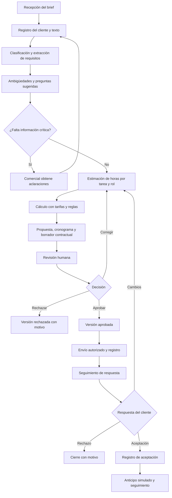
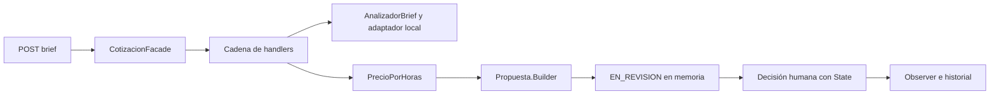

# CotizaIA

Proyecto universitario para la asignatura **Patrones de Software**.

CotizaIA es un proyecto para agencias pequeñas y freelancers. Su primera fase es una API REST que recibe un brief, detecta requisitos y preguntas mediante reglas locales, estima horas ilustrativas, calcula un precio y crea una propuesta para aprobación o rechazo humano. **Las reglas actuales no son inteligencia artificial.** La visión posterior contempla un agente sin conversación, cronogramas y borradores contractuales; no existen todavía esas capacidades.

El backend está escrito en **Java con Spring Boot**. Guarda propuestas e historial **en memoria: se pierden al reiniciar**. PostgreSQL sigue previsto para una fase posterior.

## 1. Estado real del proyecto

**Fase 1, 29 de septiembre de 2026.** API de demostración local, con cinco endpoints, validación de entrada, cálculo con `BigDecimal`, siete patrones y pruebas automatizadas. No tiene autenticación: el nombre del revisor es declarado, no verificado. El servidor escucha en `127.0.0.1` por defecto.

| Estado | Significado | Situación actual |
| --- | --- | --- |
| Implementado | Código y pruebas de esta fase. | Recepción de brief, reglas, desglose, tarifa por solicitud, propuesta en revisión, aprobación/rechazo e historial. |
| En desarrollo | Parte del requisito global funciona; faltan capacidades indicadas. | Revisión completa, análisis semántico, gestión de propuestas y trazabilidad autenticada. |
| Propuesto | Sin implementación. | Usuarios, agencias, PostgreSQL, IA real, contratos, cronogramas, envíos, frontend, pagos simulados y métricas. |

El equipo actualizará estos estados al incorporar código y verificar sus criterios de aceptación.

## 2. Planteamiento del problema y justificación

En una agencia pequeña, el propietario o comercial suele reunir información dispersa, interpretar necesidades, consultar al equipo, estimar horas y redactar documentos. Un brief puede mezclar funcionalidades, preferencias visuales, presupuesto y fechas sin distinguir prioridades. Los datos faltantes obligan a revisar supuestos; los cambios de alcance exigen ajustar precio y planificación.

CotizaIA busca apoyar estas tareas mediante un procedimiento repetible y revisable. El equipo conservará la responsabilidad sobre las tarifas, el alcance y las condiciones. El interés académico consiste en separar estas responsabilidades y aplicar patrones a problemas concretos de integración, cálculo y control de estados.

**Objetivo medible propuesto:** reducir al menos un 30 % la mediana del tiempo de preparación de una cotización revisada frente al procedimiento manual, usando diez briefs comparables. El equipo medirá desde el inicio del análisis hasta la aprobación interna, incluyendo correcciones y excluyendo la espera de respuestas del cliente. Alternará el orden de las modalidades y aplicará la misma lista de verificación de calidad. La línea base y los resultados están pendientes; la reducción no se ha demostrado.

## 3. Objetivos

### Objetivo general

Desarrollar en Java una plataforma que apoye la preparación de cotizaciones a partir de briefs, con cálculo trazable mediante tarifas configuradas y revisión humana obligatoria, aplicando patrones de software a su arquitectura.

### Objetivos específicos

- Registrar agencias, usuarios, clientes, servicios y tarifas.
- Transformar el texto del brief en requisitos, ambigüedades y estimaciones revisables.
- Calcular precios y cronogramas con datos y reglas explícitas.
- Preparar y editar propuestas y borradores contractuales con versiones identificables.
- Controlar revisión, aprobación, envío y seguimiento mediante transiciones válidas.
- Integrar IA mediante una interfaz Java sustituible y validar sus respuestas.
- Evaluar tiempo de preparación y calidad con casos de prueba documentados.

## 4. Actores del sistema

| Actor | Responsabilidad | Interacción prevista |
| --- | --- | --- |
| Propietario o comercial de agencia | Administrar datos comerciales y autorizar las condiciones y el envío. | Registra briefs, corrige resultados, aprueba versiones y registra seguimiento. |
| Colaborador revisor | Verificar requisitos, horas, supuestos y cronograma. | Consulta la cola de revisión, edita según sus permisos y devuelve observaciones o rechaza versiones. |
| Cliente | Proporcionar necesidades y aclaraciones; aceptar o rechazar propuestas. | Entrega el brief y recibe la propuesta aprobada. Inicialmente, el comercial registra sus respuestas; no se presupone un portal. |
| Agente de IA | Apoyar análisis y redacción mediante resultados estructurados. | Procesa etapas y entrega sugerencias; no puede aprobar, enviar, fijar condiciones finales ni firmar. |

## 5. Flujo de trabajo completo

Este flujo es **propuesto**. El comercial incorporará cada aclaración al brief como una nueva revisión; el agente no conversará con el cliente.



Ante un fallo de IA, el responsable podrá completar el análisis manualmente. Antes de incorporar integraciones de envío, el comercial enviará por su canal habitual y registrará el evento sobre una versión aprobada. Ese registro no acreditará una integración automática.

## 6. Alcance y límites

La fase implementada comprende backend, ingreso de texto, cliente como nombre libre, tarifa por solicitud, cálculo y decisión humana. No hay catálogo ni registro independiente de clientes. Las preguntas son advertencias: la API no registra respuestas ni bloquea por ambigüedades. La persona decide tras revisar los supuestos. La aprobación interna no representa aceptación del cliente ni envío.

| Alcance propuesto | Límite |
| --- | --- |
| Sugerencias de clasificación, requisitos y horas. | El responsable verifica omisiones, supuestos y estimaciones. |
| Cálculo con tarifas, moneda y reglas registradas. | La IA no determina el precio final; los ajustes requieren registro y aprobación. |
| Documentos editables. | El contrato es un borrador sujeto a revisión; no incluye firma automática ni validez jurídica garantizada. |
| Aceptación y anticipo simulado. | No se procesa dinero real ni se comprueban transacciones bancarias. |
| Seguimiento de propuestas. | No comprende una plataforma completa de contabilidad, facturación o gestión de proyectos. |
| Integraciones posteriores. | Correo, WhatsApp, archivos, costos de servicios y despliegue requieren evaluación e implementación. |

La tecnología de la interfaz de usuario en Java está pendiente de selección.

## 7. Requisitos funcionales

**Prioridades:** alta = necesaria para el flujo principal; media = ampliación posterior. Los criterios conservan el alcance global; «En desarrollo» identifica el subconjunto disponible, sin dar por satisfecho todo el requisito.

| ID | Requisito | Actor | Prioridad | Criterio de aceptación | Estado |
| --- | --- | --- | --- | --- | --- |
| RF-01 | Registrar agencias y usuarios e iniciar sesión. | Propietario y revisor | Alta | Crear agencia y usuario; aceptar credenciales válidas, rechazar inválidas y bloquear consultas a otra agencia. | Propuesto |
| RF-02 | Administrar servicios y tarifas por rol. | Propietario | Alta | Guardar servicio, rol, valor por hora y moneda; rechazar valores negativos y conservar la tarifa usada en cada cotización. | Propuesto |
| RF-03 | Registrar clientes. | Comercial | Alta | Crear y consultar un cliente asociado a una agencia; rechazar registros sin nombre y consultas desde otra agencia. | Propuesto |
| RF-04 | Ingresar briefs mediante texto pegado. | Comercial | Alta | Guardar texto no vacío con cliente, agencia y fecha; recuperar el contenido original sin alteraciones. | En desarrollo: texto, cliente y fecha en memoria; sin agencias. |
| RF-05 | Clasificar proyectos y extraer requisitos. | Agente y revisor | Alta | Producir una categoría y requisitos identificables con referencia al texto o marca de supuesto para un brief de prueba. | En desarrollo: cuatro categorías de requisitos por palabras clave; sin clasificación de proyecto ni IA. |
| RF-06 | Identificar ambigüedades y preguntas aclaratorias. | Agente y comercial | Alta | Ante un brief sin alcance de pagos, registrar la omisión y una pregunta; impedir aprobación si queda una ambigüedad crítica. | En desarrollo: preguntas fijas; sin bloqueo por ambigüedad. |
| RF-07 | Estimar horas con desglose. | Agente y revisor | Alta | Mostrar tarea, rol, horas y supuestos por ítem; comprobar suma del total y rechazar horas negativas. | En desarrollo: tareas y horas ilustrativas; sin roles ni edición. |
| RF-08 | Calcular precio mediante tarifas y reglas. | Comercial | Alta | Con 10 horas a 50.000 COP y 4 a 60.000 COP, sin ajustes, obtener 740.000 COP; bloquear el cálculo si falta una tarifa. | En desarrollo: una tarifa por solicitud, sin tarifas por rol ni catálogo. |
| RF-09 | Generar y editar propuestas. | Comercial y revisor | Alta | Crear versión con alcance, exclusiones, ítems, moneda y total; guardar una edición e invalidar la aprobación anterior. | En desarrollo: creación y consulta JSON; sin edición ni versiones. |
| RF-10 | Generar y editar cronogramas. | Comercial y revisor | Alta | Crear fases con horas, dependencias y capacidad declarada; recalcular la planificación al modificar horas. | Propuesto |
| RF-11 | Generar y editar borradores contractuales. | Comercial y revisor | Alta | Obtener un documento marcado como borrador, vinculado a la versión de propuesta y con campos pendientes identificados. | Propuesto |
| RF-12 | Gestionar cola de revisión, aprobación y rechazo. | Comercial y revisor | Alta | Listar pendientes; registrar usuario y fecha de decisión, exigir motivo al rechazar y bloquear acciones sin permiso. | En desarrollo: listado, decisiones e historial; sin usuarios autenticados ni permisos. |
| RF-13 | Registrar envío y seguimiento. | Comercial | Alta | Rechazar envío de una versión no aprobada; registrar canal, fecha y versión al marcar envío y consultar historial. | Propuesto |
| RF-14 | Registrar aceptación o rechazo del cliente. | Cliente mediante comercial | Alta | Registrar respuesta, fecha y referencia de evidencia sobre una versión enviada; impedir aceptar un borrador. | Propuesto |
| RF-15 | Registrar anticipo simulado. | Comercial | Media | Asociar importe a una propuesta aceptada, marcarlo como simulación y rechazar importes negativos o superiores al total. | Propuesto |
| RF-16 | Consultar métricas. | Propietario | Media | Con datos conocidos, verificar cantidades por estado, tasa de aceptación y mediana del tiempo de preparación, indicando período y denominadores. | Propuesto |
| RF-17 | Integrar canales de entrada y envío. | Comercial | Media | Para cada canal incorporado, probar autorización, asociación al cliente, prevención de duplicados y registro de fallos; bloquear envíos sin aprobación. | Propuesto |

RF-17 contempla correo, WhatsApp y carga de archivos como integraciones posteriores. Ninguno existe todavía.

## 8. Requisitos no funcionales

Estos umbrales expresan el objetivo global. El backend valida entradas y transiciones y registra decisiones en memoria; no garantiza seguridad multiagencia, persistencia, rendimiento ni disponibilidad de IA.

| ID | Categoría | Requisito medible | Forma de verificación | Estado |
| --- | --- | --- | --- | --- |
| RNF-01 | Seguridad | Proteger el 100 % de operaciones privadas con autenticación y autorización por agencia; almacenar contraseñas mediante hash adaptativo. | Probar accesos sin sesión, con rol insuficiente y entre agencias; inspeccionar almacenamiento. | Propuesto |
| RNF-02 | Privacidad | Excluir credenciales y datos de contacto innecesarios del 100 % de solicitudes al modelo y registros técnicos. | Capturar solicitudes y logs con datos ficticios; documentar retención antes de usar datos reales. | Propuesto |
| RNF-03 | Integridad de estados | Rechazar el 100 % de transiciones inválidas y ediciones concurrentes sobre versiones obsoletas. | Pruebas de matriz de estados, concurrencia y transacciones. | En desarrollo: transiciones finales y decisiones concurrentes probadas; sin edición/versionado. |
| RNF-04 | Rendimiento | Alcanzar p95 menor o igual a 2 segundos en CRUD con 20 usuarios concurrentes durante 5 minutos, excluyendo IA y documentos. | Prueba de carga con equipo, volumen y configuración documentados. | Propuesto |
| RNF-05 | Disponibilidad ante errores de IA | Limitar cada intento a 30 segundos y permitir como máximo un reintento automático; conservar el brief y habilitar revisión manual. | Simular timeout, indisponibilidad y respuesta inválida; verificar datos y recuperación manual. | Propuesto |
| RNF-06 | Trazabilidad | Registrar actor, fecha, versión y motivo en el 100 % de aprobaciones, rechazos y cambios comerciales; identificar cada ejecución de IA. | Comparar eventos de prueba con historial, sin exponer secretos. | En desarrollo: evento por decisión con revisor declarado; sin identidad verificada, versiones ni IA. |
| RNF-07 | Mantenibilidad | Probar cada regla de cálculo y transición; evitar dependencias del dominio hacia adaptadores de IA. | Ejecutar pruebas unitarias y revisar dependencias entre paquetes. | En desarrollo: pruebas de precio, cadena, reglas, sustitución y estados; dominio sin dependencia del adaptador. |
| RNF-08 | Portabilidad entre proveedores | Sustituir Ollama por Groq mediante configuración y adaptador, sin modificar servicios de negocio. | Ejecutar las mismas pruebas de contrato con ambos adaptadores y respuestas controladas. | Propuesto |
| RNF-09 | Usabilidad | Lograr que al menos 4 de 5 participantes registren un brief y completen su revisión en menos de 10 minutos sin ayuda. | Prueba de tareas con datos ficticios cuando exista interfaz. | Propuesto |
| RNF-10 | Accesibilidad | Completar el flujo principal con teclado, foco visible, campos etiquetados y contraste de texto normal de al menos 4,5:1. | Medir contraste y probar teclado y lector de pantalla compatible con la interfaz Java elegida. | Propuesto |

## 9. Reglas de negocio

**Aplicado en la fase 1:** tarifa positiva por solicitud, cálculo decimal, propuesta inicial `EN_REVISION`, una única decisión final e historial con revisor declarado y motivo. Las siguientes reglas describen el alcance global: las referencias a envíos, edición, agencias, contratos y aceptación del cliente siguen pendientes. En particular, el bloqueo por ambigüedades críticas todavía no existe.

1. Ninguna propuesta podrá enviarse ni registrarse como enviada sin aprobación humana de su versión vigente.
2. El precio se calculará con horas, tarifas y reglas registradas. Cada cotización conservará los valores utilizados y su moneda.
3. Cambiar horas obligará a recalcular precio y cronograma. Cambiar alcance, tarifas o condiciones invalidará la aprobación de la versión editada.
4. El responsable resolverá las ambigüedades críticas antes de aprobar; una pregunta de IA no equivale a una respuesta del cliente.
5. La IA no podrá aprobar, enviar, ejecutar pagos, firmar ni decidir el precio final.
6. Cada rechazo incluirá motivo; cada aprobación identificará usuario y versión.
7. La aceptación corresponderá a una versión enviada. Los cambios posteriores producirán una nueva versión sujeta a revisión.
8. No podrá emitirse contrato final antes de la aceptación y revisión humana de sus condiciones. La firma y formalización quedan fuera del alcance inicial.
9. Un pago simulado no acreditará cobro real y solo corresponderá a una propuesta aceptada.
10. Los usuarios accederán a datos de su agencia según sus permisos.
11. No se mezclarán monedas sin una regla explícita. Redondeo, impuestos y descuentos deberán definirse antes de implementar el cálculo.
12. El cronograma considerará capacidad y dependencias; las horas de esfuerzo no equivalen por sí solas a días calendario.

## 10. Arquitectura actual y evolución

| Paquete | Responsabilidad actual |
| --- | --- |
| `api` | Controlador REST, DTO de entrada/salida, validaciones y errores HTTP. |
| `service` | `CotizacionFacade` coordina el caso de uso. |
| `domain` | Brief, propuesta con Builder, ítems y eventos. |
| `agent` | Interfaz de análisis, adaptador local, motor de reglas y handlers. El nombre del paquete no implica IA. |
| `pricing` | Estrategia de precio por horas con `BigDecimal`. |
| `workflow` | Objetos State, publicación Observer e historial. |
| `repository` | Contrato de repositorio e implementación con `ConcurrentHashMap`. |
| `config` | Ensamblaje de la cadena por inyección de dependencias. |

El controlador delega en la fachada. Cada petición tiene su propio `ContextoBrief`; las propuestas conservan listas inmutables. La transición y su notificación se sincronizan por propuesta para impedir dos decisiones exitosas simultáneas. La respuesta HTTP contiene una copia del estado y del historial bajo el mismo bloqueo.

No hay PostgreSQL, transacciones distribuidas ni capa `document`. La sincronización protege una única instancia del proceso; no sustituye una solución de persistencia y concurrencia para varios servidores. El observador actual es síncrono y en memoria; futuros observadores externos requerirán tratamiento de fallos y garantías transaccionales.

## 11. Patrones de diseño implementados

| Patrón | Tipo | Clase concreta | Función en el flujo real |
| --- | --- | --- | --- |
| Facade | Estructural | `CotizacionFacade` | Coordina cadena, estrategia, Builder, almacenamiento y decisiones. |
| Chain of Responsibility | Comportamiento | `ValidarBrief`, `DetectarRequisitos`, `IdentificarAmbiguedades`, `EstimarHoras` | Cada handler recibe `ContextoBrief` y delega al siguiente; una entrada inválida detiene la cadena antes del análisis. |
| Strategy | Comportamiento | `EstrategiaPrecio`, `PrecioPorHoras` | La fachada usa el contrato para multiplicar horas totales por tarifa, sin conocer la implementación. |
| Builder | Creacional | `Propuesta.Builder` | Reúne brief, requisitos, preguntas, desglose y precio; crea la propuesta en revisión sin constructor público extenso. |
| State | Comportamiento | `EstadoRevision`, `EnRevision`, `Aprobada`, `Rechazada` | Los objetos de estado permiten o rechazan aprobar/rechazar. La enumeración solo identifica el estado en la respuesta. |
| Observer | Comportamiento | `PublicadorEventos`, `ObservadorEstado`, `HistorialEventos` | Tras una decisión válida, el publicador notifica al observador, que guarda el evento consultable en `historial`. |
| Adapter | Estructural | `AnalizadorBrief`, `AdaptadorReglasLocales`, `MotorReglasLocales` | Traduce códigos del motor de palabras clave al contrato usado por los handlers. Permite otro analizador sin modificar la fachada. |

Los siete tienen uso en el flujo. No se implementan Factory Method, Template Method, Decorator ni Singleton por requisito académico: podrían evaluarse para construcción de proveedores, documentos, extras y configuración si aparece una necesidad real. La creación de beans de Spring no se presenta como demostración de esos patrones.



## 12. Análisis local actual e IA futura

**No hay IA, llamadas a Ollama/Groq ni credenciales.** `MotorReglasLocales` normaliza mayúsculas y acentos y busca palabras completas. Reconoce cada requisito una sola vez:

| Palabras reconocidas | Requisito | Horas ilustrativas |
| --- | --- | --- |
| página, páginas, web, sitio | Página web | 8 |
| menú, menús, carta | Menú digital | 8 |
| reserva, reservas, reservar | Reservas | 8 |
| pago, pagos, pagar | Pagos | 8 |

La fórmula es `4 horas de análisis + 8 por requisito distinto + 4 de pruebas y revisión`. Con cero coincidencias se estiman solo 8 horas base y se pregunta por las funcionalidades: no se inventan requisitos. No interpreta negaciones, dependencias, complejidad ni fechas; por ejemplo, «no quiero pagos» también activa la palabra. Es una limitación explícita para la exposición.

El motor añade preguntas fijas por menú, reservas y pagos. Si detecta diciembre pregunta por día y año; en otro caso pregunta por fecha exacta. Estas preguntas invitan a revisar información, no demuestran que el dato esté ausente. El precio es `horasTotales × tarifa`, en COP, con dos decimales y `HALF_UP`; no incluye impuestos, descuentos, costos externos ni tarifas por rol.

Contrato existente:

```java
public interface AnalizadorBrief {
    List<String> detectarRequisitos(String texto);
    List<String> identificarAmbiguedades(String texto);
}
```

Para incorporar IA real será necesario implementar otro adaptador, seleccionar proveedor/modelo mediante configuración, definir un esquema de respuesta y validar campos, tipos, límites y referencias al brief. También faltan timeouts, reintentos limitados, registro de ejecuciones, protección de datos y recuperación manual frente a fallos. La IA futura seguirá sin autorizar envíos, decidir el precio final o firmar contratos. El cálculo y State permanecerán en Java.

## 13. Modelo de datos propuesto

**No existen tablas.** Actualmente hay `Brief` (cliente como texto, texto original y tarifa), `Propuesta`, `ItemEstimado`, `EstadoPropuesta` y `EventoEstado` en Java. La propuesta conserva el brief en memoria; no existe un registro independiente de clientes, tarifas o agencias. La tabla siguiente conserva el modelo futuro, distinto de estos objetos actuales.

| Entidad | Información prevista | Relaciones propuestas |
| --- | --- | --- |
| Agencia | Nombre y configuración comercial. | Tiene usuarios, clientes, servicios y tarifas. |
| Usuario | Identidad, credenciales protegidas y rol de acceso. | Pertenece a una agencia; registra acciones y revisiones. |
| Cliente | Nombre y contacto necesario. | Pertenece a una agencia y tiene briefs. |
| Tarifa | Rol profesional, valor por hora, moneda y vigencia. | Pertenece a una agencia; sus valores se copian a ítems para conservar historial. |
| Servicio | Nombre, descripción y categoría. | Pertenece a una agencia; puede aparecer en varios ítems. |
| Brief | Texto original, fecha y revisión. | Pertenece a un cliente; tiene requisitos, ejecuciones y propuestas. |
| Requisito | Descripción, prioridad, origen y ambigüedades. | Pertenece a un brief; puede relacionarse con varios ítems. |
| EjecuciónAgente | Proveedor, modelo, etapa, fechas, estado y errores depurados. | Pertenece a un brief e identifica el origen del análisis. |
| Propuesta | Versión, estado, moneda, total y decisiones. | Pertenece a un brief; contiene ítems y fases; tiene contratos y pagos simulados. |
| ÍtemCotizado | Tarea, rol, horas, copia de tarifa y subtotal. | Pertenece a una propuesta; referencia servicio opcional y requisitos cubiertos. |
| Fase | Nombre, orden, esfuerzo, capacidad y fechas. | Pertenece a una propuesta; agrupa ítems y puede depender de otras fases. |
| Contrato | Texto, versión, campos pendientes y revisión. | Referencia una versión de propuesta; conserva condición de borrador hasta cumplir las reglas. |
| PagoSimulado | Importe, fecha y marca de simulación. | Pertenece a una propuesta aceptada e identifica al usuario responsable. |

El esquema definitivo resolverá relaciones de varios a varios, restricciones, versiones y auditoría. El diseño deberá evitar borrados que eliminen evidencia de decisiones comerciales.

## 14. Tecnologías y ejecución

| Elemento | Configuración real |
| --- | --- |
| Java | Código compilado con `release 21`; requiere JDK 21 o superior compatible. Pruebas ejecutadas con Java 21.0.12 y ejecución HTTP del JAR comprobada con Java 26. |
| Spring Boot | 4.0.8, con Spring MVC y Jakarta Validation. |
| Construcción | Maven 3.9.11 mediante Maven Wrapper. La primera ejecución requiere internet para descargar Maven y dependencias. |
| Pruebas | JUnit, Spring Boot Test y MockMvc. |
| Persistencia | `ConcurrentHashMap` y cola de eventos en memoria; sin PostgreSQL. |
| Red | `127.0.0.1:8080` por defecto. `PORT` permite cambiar puerto. |
| Seguridad | Sin autenticación ni permisos; demostración local con datos ficticios. |
| IA / credenciales | No se usan proveedores ni claves API. |

La compatibilidad del framework se puede consultar en los [requisitos oficiales de Spring Boot](https://docs.spring.io/spring-boot/4.0/system-requirements.html). `JAVA_HOME`, si está definido, debe apuntar a un JDK compatible; puede diferir del `java` que aparece primero en el PATH.

En PowerShell, desde la carpeta del proyecto:

```powershell
Set-Location 'D:\Escritorio\cotizaIA'
.\mvnw.cmd -v
.\mvnw.cmd test
.\mvnw.cmd package
java -jar .\target\cotizaia-0.1.0.jar
```

Alternativa durante desarrollo: `./mvnw.cmd spring-boot:run`. Detener con `Ctrl+C`. Al reiniciar, se pierden las propuestas y los eventos. Para cambiar el puerto antes de iniciar:

```powershell
$env:PORT = '8081'
```

Si Maven informa `PKIX path building failed` en Windows, durante esta preparación funcionó usar el almacén de certificados de Windows. La opción mantiene la validación TLS y solo afecta a la sesión actual:

```powershell
$env:MAVEN_OPTS = '-Djavax.net.ssl.trustStoreType=Windows-ROOT -Djavax.net.ssl.trustStore=NONE'
.\mvnw.cmd test
```

### API disponible

| Método | Endpoint | Resultado |
| --- | --- | --- |
| POST | `/api/briefs` | `201 Created`, propuesta en revisión y cabecera `Location`. |
| GET | `/api/propuestas` | `200 OK`, lista de todas las propuestas, sin paginación ni filtros. |
| GET | `/api/propuestas/{id}` | `200 OK`, propuesta e historial. |
| POST | `/api/propuestas/{id}/aprobar` | `200 OK`, estado `APROBADA` y evento. |
| POST | `/api/propuestas/{id}/rechazar` | `200 OK`, estado `RECHAZADA` y evento. |

Creación: `cliente` obligatorio de hasta 120 caracteres; `texto` de 10 a 10.000 caracteres, con al menos 10 después de quitar espacios de extremos; `tarifa` positiva con hasta 9 enteros y 2 decimales. Se conserva el texto original. Decisiones: `revisor` obligatorio de hasta 120 caracteres y `motivo` obligatorio de hasta 1.000. No hay endpoint de edición, envío o eliminación.

| Error | HTTP | Comportamiento |
| --- | --- | --- |
| Datos inválidos, JSON incorrecto, UUID mal formado | 400 | Respuesta de error; no crea propuesta ni cambia estado. |
| UUID válido inexistente | 404 | Propuesta no encontrada. |
| Aprobar o rechazar una propuesta finalizada | 409 | Conserva estado e historial; no genera otro evento. |

Los errores controlados usan `ProblemDetail` con `status`, `title` y `detail`; los errores de campos incluyen `errores`.

### Verificación automatizada

`CotizacionApiTest` prueba creación, detalle, listado, ambas transiciones, cuatro intentos de cambiar estados finalizados, validación, UUID inválido y recurso inexistente. `PatronesTest` prueba precisión decimal, detención de la cadena, reglas sin duplicados, sustitución del analizador y una única decisión exitosa ante concurrencia. Resultado de la fase: **17 pruebas, 0 fallos, 0 errores**. Los informes se generan en `target/surefire-reports`. También se comprobó el JAR con solicitudes HTTP reales de creación, listado, consulta, aprobación y rechazo posterior bloqueado con 409.

## 15. Ejemplo ejecutable del restaurante

> Necesito una página para mi restaurante con menú, reservas y pagos para diciembre

Ejecutar en otra ventana de PowerShell mientras el servidor está activo:

```powershell
$base = 'http://127.0.0.1:8080'
$brief = @{
    cliente = 'Restaurante La Mesa'
    texto = 'Necesito una página para mi restaurante con menú, reservas y pagos para diciembre'
    tarifa = 50000.00
} | ConvertTo-Json
$propuesta = Invoke-RestMethod -Method Post -Uri "$base/api/briefs" `
    -ContentType 'application/json; charset=utf-8' `
    -Body ([Text.Encoding]::UTF8.GetBytes($brief))
$propuesta | ConvertTo-Json -Depth 8
Invoke-RestMethod -Uri "$base/api/propuestas"
Invoke-RestMethod -Uri "$base/api/propuestas/$($propuesta.id)"

$decision = @{
    revisor = 'Revisor de demostración'
    motivo = 'Revisé el alcance y acepto las estimaciones ilustrativas'
} | ConvertTo-Json
Invoke-RestMethod -Method Post -Uri "$base/api/propuestas/$($propuesta.id)/aprobar" `
    -ContentType 'application/json; charset=utf-8' `
    -Body ([Text.Encoding]::UTF8.GetBytes($decision))
```

Respuesta de creación con estructura real; UUID y fecha son ejemplos y cambiarán en cada ejecución:

```json
{
  "id": "7a5d627d-f52c-4497-9a43-0597466d5f3a",
  "cliente": "Restaurante La Mesa",
  "textoOriginal": "Necesito una página para mi restaurante con menú, reservas y pagos para diciembre",
  "requisitos": ["Página web", "Menú digital", "Reservas", "Pagos"],
  "preguntasAclaratorias": [
    "¿Quién administra el menú y entrega sus contenidos?",
    "¿Qué horarios, cupos y reglas de cancelación tendrán las reservas?",
    "¿Qué se pagará, en qué moneda y mediante qué proveedor?",
    "¿Cuál es el día y año de entrega en diciembre?"
  ],
  "desgloseHoras": [
    {"tarea": "Análisis del brief", "horas": 4},
    {"tarea": "Página web", "horas": 8},
    {"tarea": "Menú digital", "horas": 8},
    {"tarea": "Reservas", "horas": 8},
    {"tarea": "Pagos", "horas": 8},
    {"tarea": "Pruebas y revisión", "horas": 4}
  ],
  "horasTotales": 40,
  "tarifa": 50000.00,
  "moneda": "COP",
  "precioTotal": 2000000.00,
  "fecha": "2026-09-29T16:00:00Z",
  "estado": "EN_REVISION",
  "historial": []
}
```

**Horas y precio ilustrativos, sujetos a revisión humana.** Detectar «Pagos» solo añade un requisito y su estimación: no implementa una pasarela ni un cobro simulado. Tampoco convierte «diciembre» en una fecha comprometida ni genera cronograma.

Después de aprobar, el estado será `APROBADA` y `historial` contendrá un evento con `propuestaId`, `anterior`, `nuevo`, `fecha`, `revisor` y `motivo`. Para demostrar rechazo, crear otra propuesta y usar `/rechazar` con el mismo formato de decisión. Repetir cualquiera de las decisiones sobre una propuesta finalizada devuelve `409 Conflict` y conserva un único evento. No se envían correos.

## 16. Plan de desarrollo por fases

La fase 1 tiene implementado su flujo básico con reglas locales y revisión. Sus ampliaciones y las fases 2 a 4 siguen pendientes.

| Fase | Trabajo previsto | Evidencia de cierre |
| --- | --- | --- |
| 1. Backend y revisión humana | Implementado: Spring Boot, dominio, texto, reglas, cálculo y decisiones en memoria. Pendiente: edición y resolución de preguntas. | API y pruebas de creación, cálculo, entradas inválidas, estados y concurrencia. No hay endpoint de envío. |
| 2. Persistencia y seguridad | Incorporar PostgreSQL, migraciones, registro, inicio de sesión, permisos, aislamiento por agencia e historial. | Datos conservados entre reinicios y pruebas de autorización, aislamiento y concurrencia. |
| 3. IA y documentos | Implementar contrato de proveedor, primer adaptador, validación, manejo de fallos y documentos editables. | Análisis controlados, recuperación manual y documentos coherentes con la versión revisada. |
| 4. Integraciones, frontend y métricas | Construir interfaz en Java, evaluar canales, registrar anticipos simulados y medir tiempos y estados. | Flujo desde la interfaz, pruebas de canales incorporados y evaluación del objetivo temporal. |

## 17. Equipo y responsabilidades

Completar según los acuerdos del equipo. Una persona puede asumir varias áreas.

| Integrante | Área sugerida | Tareas asignadas | Evidencia o entrega |
| --- | --- | --- | --- |
| [Nombre pendiente] | Backend y dominio | [Completar] | [Completar] |
| [Nombre pendiente] | Persistencia y seguridad | [Completar] | [Completar] |
| [Nombre pendiente] | IA y documentos | [Completar] | [Completar] |
| [Nombre pendiente] | Interfaz, pruebas y documentación | [Completar] | [Completar] |

**Por completar:** integrantes, configuración de PostgreSQL, autenticación y permisos, interfaz Java, proveedor y modelo de IA, documentos, reglas comerciales definitivas y evaluación de tiempos.
